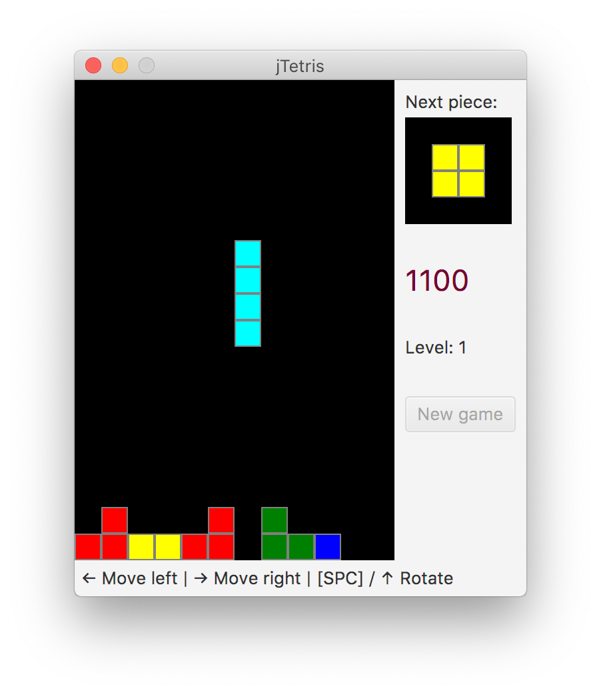

# jTetris

A quick and dirty Tetris clone written in Java using JavaFX and my own [SquareGrid](https://github.com/SpinningVinyl/SquareGrid) class.

### License

This project is shared under the terms of [CC BY-NC-SA 4.0](https://creativecommons.org/licenses/by-nc-sa/4.0/) license.
